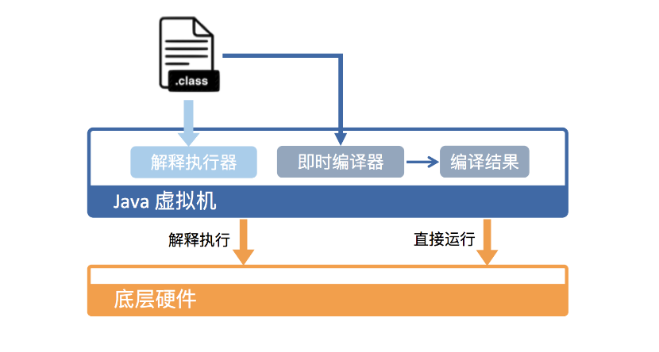

**Java 虚拟机具体是怎样运行 Java 字节码的?**

执行 Java 代码首先需要将它编译而成的 class 文件加载到Java虚拟机中。加载后的Java类会被存放于方法区（Method Area）中。实际运行时，虚拟机会执行方法区内的代码。

在运行过程中，每当调用一个Java方法，Java虚拟机会在当前线程的Java方法栈中生成一个栈帧，用来存放局部变量以及字节码的操作数。这个栈帧的大小是提前计算好的，并且Java虚拟机不要求栈帧在内存空间里连续分布。当退出当前执行方法时，不管正常还是异常返回，Java虚拟机都会弹出当前线程的当前栈帧，并且舍弃。

从硬件角度看，Java字节码无法直接执行。所以Java虚拟机需要将字节码翻译成机器码。在HotSpot里，将字节码翻译成机器码有两种形式：第一种是解释执行，逐条将字节码翻译成机器码并执行;第二种是即时编译（Just-In-time compilation，JIT），即将一个方法中包含的所有字节码编译成机器码后在执行。前者优势在于无需等待编译，而后者的优势在于实际运行速度更快。HotSpot默认采用混合模式。它会先解释执行字节码，而后将其中反复执行的热点代码，以方法为单位进行即时编译。

**Java虚拟机的运行效率？**

二八定律。对于占据大部分不常用的代码，不需要耗费时间将其编译成机器码，而是采用解释执行的方式运行;对于仅占据小部分热点的代码，采用编译成机器码。理论上讲，即时编译后的Java程序的执行效率是有可能超过C++程序。因为与静态编译相比，即时编译拥有程序运行时信息，并且能够根据这个信息做出相应优化。

