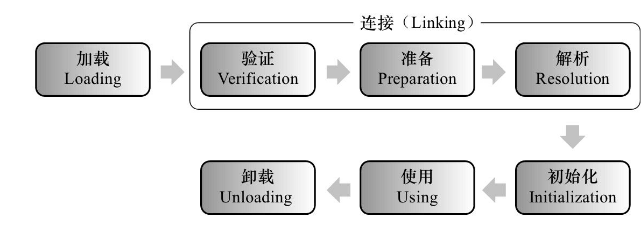
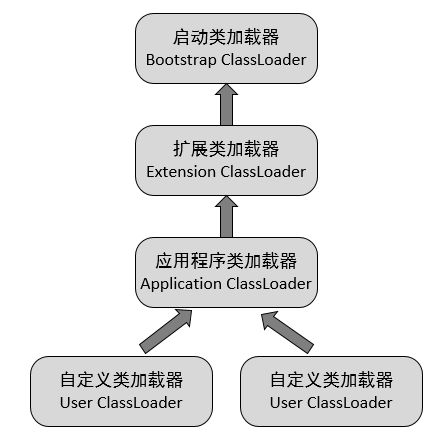

# java类加载

## **类加载时机**

类从被加载到虚拟机内存开始，到卸载出内存为止。它的整个生命周期包括：加载（Loading）、验证（Verification）、准备（Preparation）、解析（Resolution）、初始化（Initialization）、使用（Using）和卸载（Unloading）7个阶段。其中验证、准备、解析3阶段统称为连接（Linking）。



对于开始类加载过程的第一个阶段**加载**，Java虚拟机并没有强制约束，可以交给虚拟机自由把握。但是对于初始化阶段，虚拟机规范严格规定了有且只有5种情况必需立即对类进行“初始化”（而加载、验证、准备需要再这之前开始）

- 遇到new、getstatic、putstatic或invokestatic这4条字节码指令时，如果类没有进行过初始化，则需要先初始化。生成这4条指令最常见的Java代码场景是：使用new关键字实例化对象的时候、读取或设置一了类的静态字段（被final修饰、已在编译期把结果放到常量池的静态字段除外）的时候，以及调用一个类的静态方法。
- 使用java.lang.reflect包的方法对类进行反射调用的时候，如果类没有进行过初始化，则需要先触发其初始化。
- 当初始化一个类的时候，如果发现其父类还没有进行初始化，则需要先触发其父类的初始化。
- 当虚拟机启动时，用户需要指定一个要执行的主类（包含main()方法的那个类），虚拟机会先初始化这个主类。
- 当JDK1.7的动态语言支持时，如果一个java.lang.invoke.MethodHandle实例最后的解析结果 REF_getStatic、REF_putStatic、REF_invokeStatic的方法句柄，并且这个方法句柄所对应的类没有进行过初始化，则需要先进行初始化。

> 注：当一个类在初始化时，要求其父类全部都已经初始化过了，但是一个接口在初始化的时，并不要求其父接口全部都完成了初始化，只有在真正使用到父类接口的时候（如引用父类定义的常量）才会初始化。

## **类加载过程**

**加载**
类的加载阶段主要完成以下工作：

- 通过一个类的全限定名来获取定义此类的二进制流。
- 将这个字节流所代表的静态存储结构转化为方法区的运行时结构。
- 在内存中生成一个代表这个类的java.lang.Class对象，作为方法区这个类的各种数据的访问入口

**验证**
验证是连接阶段的第一步，这一阶段为了确保Class文件的字节流中包含的信息符合当前虚拟机的要求，并且不会危害虚拟机自身的安全。验证阶段大致会完成以下4个阶段的检验动作：文件格式验证、元数据验证、字节码验证、符号引用验证。

**准备**
准备阶段是正式为类变量分配内存并设置类变量初始值的阶段，这些变量所使用的内存都将在方法区中进行分配。这时候进行内存分配的仅包括类变量（被static修饰的变量），而不包括实例变量，实例变量将会在对象实例化时随着对象一起分配在Java堆中。而”初始值“通常情况下是数据类型的零值。在一些特殊情况下，如果类字段的字段属性表中存在ConstantValue属性，那在准备阶段变量value就会被初始化为ConstantValue属性所指定的值。
**解析**
虚拟机将常量池内的符号引用替换为直接引用的过程。解析动作主要是针对类或者接口、字段、类方法、接口方法、方法类型、方法句柄和调用点限定符7类符号引用进行。“动态解析”的含义就是必须等到程序实际运行到这条指令的时候，解析动作才能进行。相对的，其余可触发解析的指令都是“静态”的，可以在刚刚完成加载阶段，还没有开始执行代码时就进行解析。
**初始化**
类的初始化阶段是类加载的最后一步，在前面的类加载过程中除了加载阶段是用户应用程序可以通过自定义类加载器参与之外，其余动作都是由虚拟机主导和控制。到了初始化阶段，才真正开始执行类中定的Java字节码。而初始化阶段就是执行类构造器 < clinit >()方法的过程。< clinit >()方法是由编译器自动收集类中的所有类变量的赋值动作和静态语句块中的语句合并产生的。< clinit >()与类的构造函数不同，它不需要显示地调用父类构造器，虚拟机会保证在子类的< clinit >()方法执行之前，父类的< clinit >()方法已经执行完毕。

## **类加载器**

### **类加载器分类**

对于任何一个类，都需要由加载他的类加载器和这个类的本身一同确定其在Java虚拟机中的唯一性，每一个了类加载器，都拥有一个独立的类名空间。也就是说比较两个类是否”相等“
，只有在这两个类是由同一个类加载器加载的前提下才有意义，否则，即使这两个类来源于同一个Class文件，被同一个虚拟机加载，只要加载它们的类加载器不同，那这两个类就必不相等。

从Java虚拟机的角度来讲，只存在两种不同的类加载器：一种是启动类加载器（Bootstrap ClassLoader），这个类加载器使用C++语言实现，是虚拟机自身的一部分;另一种就是所有其他的类加载器，这些类加载器都是由Java语言实现的，独立于虚拟机外部，并且全部都继承自抽象类java.lang.ClassLoader。

如果划分的更细致一点，，绝大部分Java程序都会使用到以下3种系统提供的类加载器。

- **启动类加载器（Bootstrap ClassLoader）**： 由C++语言实现（针对HotSpot）,负责将存放在\lib目录或-Xbootclasspath参数指定的路径中的类库加载到内存中，即负责加载Java的核心类。
- **扩展类加载器（Extension ClassLoader）**： 负责加载\lib\ext目录或java.ext.dirs系统变量指定的路径中的所有类库，即负责加载Java扩展的核心类之外的类。
- **应用程序类加载器（Application ClassLoader）**： 负责加载用户类路径（classpath）上的指定类库，我们可以直接使用这个类加载器，通过ClassLoader.getSystemClassLoader()方法直接获取。一般情况，如果我们没有自定义类加载器默认就是用这个加载器。

### **双亲委派模型**

双亲委派模型要求除了顶层的启动类加载器以外，其余的类加载器都应该有自己的父类加载器。这里的类加载器之间的父子关系一般不会以继承的关系来实现，而是都使用组合的关系来复用父加载器的代码。



双亲委派模型的工作流程是：如果一个类加载器收到了类加载的请求，它首先不会自己去尝试加载这个类，而是把请求委托给父加载器去完成，依次向上，因此，所有的类加载请求最终都应该被传递到顶层的启动类加载器中，只有当父加载器在它的搜索范围中没有找到所需的类时，即无法完成该加载，子加载器才会尝试自己去加载。

这样的好处是不同层次的类加载器具有不同优先级，比如所有Java对象的超级父类java.lang.Object，位于rt.jar，无论哪个类加载器加载该类，最终都是由启动类加载器进行加载，保证安全。即使用户自己编写一个java.lang.Object类并放入程序中，虽能正常编译，但不会被加载运行，保证不会出现混乱。

### **双亲委派模型的代码实现**

ClassLoader中loadClass方法实现了双亲委派模型

```java
protected Class<?> loadClass(String name, boolean resolve)
    throws ClassNotFoundException
{
        // First, check if the class has already been loaded
        Class c = findLoadedClass(name);
        if (c == null) {
            long t0 = System.nanoTime();
            try {
                if (parent != null) {
                    c = parent.loadClass(name, false);
                } else {
                    c = findBootstrapClassOrNull(name);
                }
            } catch (ClassNotFoundException e) {
                // ClassNotFoundException thrown if class not found
                // from the non-null parent class loader
            }

            if (c == null) {
                // If still not found, then invoke findClass in order
                // to find the class.
                long t1 = System.nanoTime();
                c = findClass(name);

                // this is the defining class loader; record the stats
            }
        }
        return c;
}
```
从上面代码中可以看出，首先检查该类是否已经被加载过，如果没有被加载则调用父加载器的loadClass()方法，如果父加载器为空则默认使用启动类加载器作为父加载器。如果父类加载失败，抛出ClassNotFoundException异常后，在调用自己的findClass()方法进行加载。
