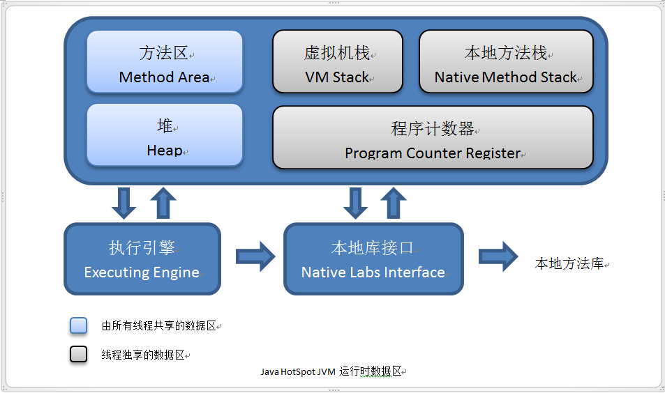

## Java内存区域划分

**程序计数器**：是一块较小内存，可以看作是当前线程所执行的字节码的行号指示器。每条线程都需要有一个独立的程序计数器，各个线程之间计数器互不影响。

**Java虚拟机栈**：Java虚拟机栈也是线程私有，他的生命周期与线程相同。虚拟机栈描述的是Java方法执行的内存模型：每个方法在执行的同时都会创建一个栈帧用于存储局部变量、操作数、操作数栈、动态链接、方法出口等信息。每一个方法的调用过程直至执行完成的过成，就对应着一个栈帧在虚拟机栈中入栈到出栈的过程。

局部变量表存放了编译期可知的各种基本数据类型、对象引用和returnAddress类型。如果**线程请求的栈深度大于虚拟机所允许的深度，将抛出StackOverflowError异常**;如果**虚拟机可以动态扩展，如扩展时无法申请到足够的内存，就会抛出OutOfMemoryError异常**。

**本地方法栈**：与虚拟机栈类似，他们之间的区别是虚拟机栈为虚拟机执行Java方法（字节码）服务，而本地方法栈则为虚拟机使用到的Native方法服务。

**Java堆**：Java堆（Java Heap）是Java虚拟机所管理的内存中最大的一块。Java堆是被所有线程共享的一块内存区域。在此内存区域中唯一目的就是存放对象实例，几乎所有的对象都在这里分配内存。

Java堆是垃圾收集器管理的主要区域。也叫“GC堆”。从内存回收的角度来看，由于现在的收集器基本都采用分代收集算法，所以Java堆还可以细分为：新生代和老年代;在细致一点的有Eden空间、From Survivor空间、To Survivor空间等。从内存分配的家读来看，线程共享的Java堆中可能划分出多个线程私有分配缓冲区（Thread Local Allocation Buffer，TLAB）。不过无论如何划分，都与存放内容无关，无论那个区域，存储的都是对象实例，进一步划分的目的是为了更好地回收内存，或者更快的分配内存。Java堆可以处于物理上不连续的内存空间中，只要逻辑上是连续的即可。

**方法区（Method Area）**：和Java堆一样也是各个线程共享的内存区域，他用于存储已被虚拟机加载的类信息、常量、静态变量、即时编译后的代码等数据。使用永久代实现方法区。

## 对象的创建

**对象内存的分配**

虚拟机遇到一条new指令时，先去检查这个指令的参数是否能在常量池中定位到一个类的符号的引用，并且检查这个符号引用代表的类是否已经被加载、解析和初始化。如果没有，那必须先执行相应的类的加载过程。在类加载检查通过后，虚拟机将为新生对象分配内存。对象所需要的内存在类加载完成之后便可完全确定。

**指针碰撞**：假设Java堆是绝对规整的，所有用过的内存放在一边，空闲的内存放在另一边，中间放一个指针作为分界点的指示器。为对象分配内存时把那个指针向空闲空间那边挪动一段与对象大小相等的距离。

**空闲列表**：Java堆中的内存不是规整的，以使用的内存和空闲的内存相互交错，无法使用指针碰撞。这时虚拟机就必须维护一个列表，记录上哪些内存是可用的，在分配内存的时候从列表中找一块足够大的空间划分给对象实例，并更新列表上的记录。

选择哪种分配方式由Java堆是否规整决定，而Java堆是否规整又由所采用的垃圾收集器是否带有压缩整理功能决定。

如果只是修改一个指针所指向的位置，在并发情况下并不是线程安全，可能出现正在给对象A分配内存，指针还没来的及修改，对象B又同时使用了原来的指针来分配内存的情况。两种解决方案，一种是对分配内存空间的动作进行同步处理——实际上虚拟机采用CAS配上失败重试的方式保证更新操作的原子性;另一种是把内存分配的动作按照线程划分在不同的空间之中进行，即每个线程在Java堆中预先分配一小块内存，称为本地线程分配缓冲（Thread Local Allocation Buffer，TLAB）。那个线程要分配内存，就在哪个线程的TLAB上分配，只有TLAB用完并分配新的TLAB时，才需要同步锁定。

**对象的内存布局**

对象在内存存储的布局可以分为3块区域：对象头（Header）、实例数据（Instance Data）和对齐填充（Padding）。

HotSpot虚拟机的对象头包括两部分信息,第一部分用于存储对象自身的运行时数据,如哈希码(HashCode),GC分代年龄,锁状态标志,线程持有的锁,偏向线程ID,偏向时间戳等.这部分数据在长度32位和64位的虚拟机(未开启压缩指针)中分别为32bit和64bit,官方称它为"Mark Word".考虑到虚拟机的空间效率,Mark Word被设计成一个非固定的数据结构以便在极小的空间内存储尽量多的信息,他会根据对象的状态复用自己的存储空间,对象头的另一部分是类型指针,即对象指向它的类元数据的指针,虚拟机通过这个指针来确定这个对象是哪个类的实例.并不是所有的虚拟机实现都必须在对象数据上保留类型指针.另外,如果对象是一个Java数组,那么在对象头中还必须有一块用于记录数组长度的数据,因为虚拟机可以通过普通Java对象的元数据信息确定Java对象的大小.

实例数据部分是对象真正存储的有效信息,也是在程序代码中多定义的各种类型字段内容.无论是从父类继承下来的,还是在子类定义的,都需要记录起来.

对其填充不是必然存在的,只是起着占位符的作用.由于HotSpot VM的自动内存管理系统要求对象起始地址必须是8字节的整数倍,也就是说对象大小必须是8字节的证书倍.对象头部分正好是8字节的倍数(1倍或者2倍),因此当实例数据部分没有对齐时,就需要通过对齐填充来补全.

**对象访问定位**

目前主流的访问方式有使用**句柄**和**直接指针**两种。

**句柄访问**：Java堆将会划分出一块内存作为句柄池，reference中存储的就是对象的句柄地址，而句柄中包含了对象实例数据和类型数据各自的具体地址信息。

**直接指针访问**：Java堆对象的布局中就须考虑如何放置访问类型数据相关信息，而reference中存储的就是对象地址。

使用句柄访问的最大好处就是reference中存储的是稳定的句柄地址，在对象被移动（垃圾收集时移动对象是非常普遍的行为）时只会改变句柄中的实例数据指针，而reference本身不需要修改。使用直接指针访问的最大好处就是速度更快，他节省了一次指针定位时间的开销。HotSpot采用的是直接指针进行对象访问的。
