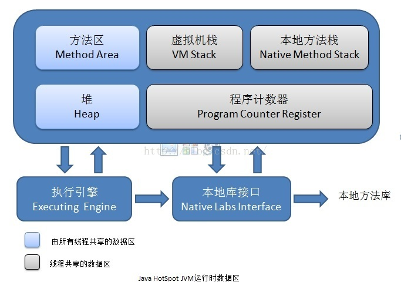

# Java内存区域划分

**程序计数器**：是一块较小内存，可以看作是当前线程所执行的字节码的行号指示器。每条线程都需要有一个独立的程序计数器，各个线程之间计数器互不影响。

**Java虚拟机栈**：Java虚拟机栈也是线程私有，他的生命周期与线程相同。虚拟机栈描述的是Java方法执行的内存模型：每个方法在执行的同时都会创建一个栈帧用于存储局部变量、操作数、操作数栈、动态链接、方法出口等信息。每一个方法的调用过程直至执行完成的过成，就对应着一个栈帧在虚拟机栈中入栈到出栈的过程。

局部变量表存放了编译期可知的各种基本数据类型、对象引用和returnAddress类型。如果线程请求的栈深度大于虚拟机所允许的深度，将抛出StackOverflowError异常;如果虚拟机可以动态扩展，如扩展时无法申请到足够的内存，就会抛出OutOfMemoryError异常。

**本地方法栈**：与虚拟机栈类似，他们之间的区别是虚拟机栈为虚拟机执行Java方法（字节码）服务，而本地方法栈则为虚拟机使用到的Native方法服务。

**Java堆**：Java堆（Java Heap）是Java虚拟机所管理的内存中最大的一块。Java堆是被所有线程共享的一块内存区域。在此内存区域中唯一目的就是存放对象实例，几乎所有的对象都在这里分配内存。

Java堆是垃圾收集器管理的主要区域。也叫“GC堆”。从内存回收的角度来看，由于现在的收集器基本都采用分代收集算法，所以Java堆还可以细分为：新生代和老年代;在细致一点的有Eden空间、From Survivor空间、To Survivor空间等。从内存分配的家读来看，线程共享的Java堆中可能划分出多个线程私有分配缓冲区（Thread Local Allocation Buffer，TLAB）。不过无论如何划分，都与存放内容无关，无论那个区域，存储的都是对象实例，进一步划分的目的是为了更好地回收内存，或者更快的分配内存。Java堆可以处于物理上不连续的内存空间中，只要逻辑上是连续的即可。

**方法区（Method Area）**：和Java堆一样也是各个线程共享的内存区域，他用于存储已被虚拟机加载的类信息、常量、静态变量、即时编译后的代码等数据。