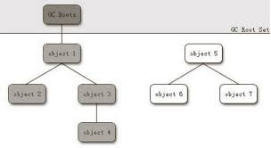
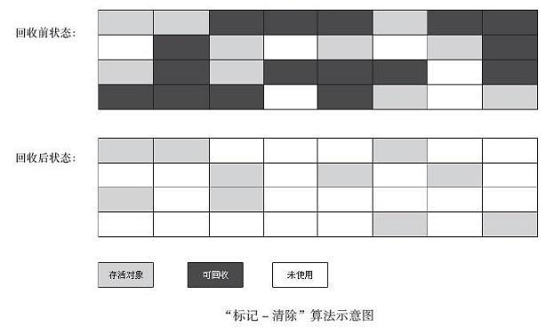
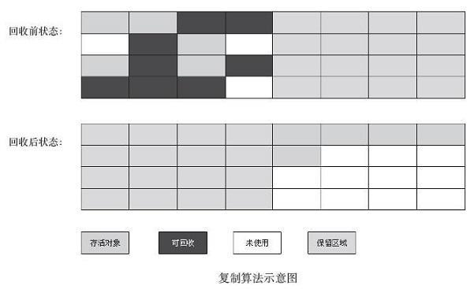
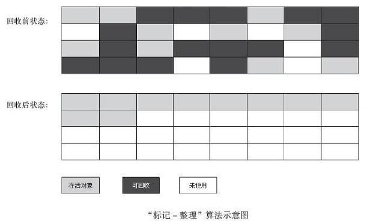

# Java垃圾回收策略

## 回收的内存区域

在Java内存运行时，其中程序计数器、虚拟机栈、本地方法栈3个区域随线程而生，随线程而灭。栈中的栈帧随着方法的进入和退出有条不紊的执行着出栈和入栈的操作。每一个栈中分配多少内存基本上是在类结构确定下来时就知道的。因此这几个区域的内存分配和回收都具有确定性，也就是说在这几个区域内不需要过多考虑回收问题，因为方法结束或者线程结束时，内存自然就跟着回收了。而在Java堆和方法区不一样，一个接口中的多个实现类需要的内存可能不一样，一个方法中的多个分支需要的多个内存也不一样，只有在程序运行期间才能知道会创建哪些对象，这部分内存的分配和回收都是动态的，垃圾回收关注的u也是这部分内存。

## 对象死亡

### 引用计数法
给对象添加一个引用器，每当有一个地方应用它时，计数器加1;当引用失效时，计数器减1;任何时刻计数器为0的对象就是不可能在被使用的。但是最主要的缺点就是**很难解决对象之间相互循环引用的问题**。

### 可达性分析算法

通过一系列的称为“GC Roots”的对象作为起始点，从这些节点开始向下搜索，搜索所走过的路径称为引用链（Reference Chain），当一个对象到GC Roots没有任何引用链相连时，则证明此对象是不可用的。

在Java中，可以作为GC Roots的对象包括一下几种：

- 虚拟机栈（栈帧中本地变量表）中引用的对象
- 方法区中类静态属性引用的对象。
- 方法区中常量引用的对象。
- 本地方法栈中JNI引用的对象。

### 引用

引用分为4类，强引用（Strong Reference）、软引用（Soft Reference）、弱引用（Weak Reference）、虚引用（Phantom Reference）。这四种引用强度依次逐渐减弱。

- 强引用：在程序代码中普遍存在的，类似“Object obj = new Object()”。只要强引用还存在，来及收集器就不会回收掉被引用的对象。
- 软引用： 描述一些还有用但并非必需的对象。对于软引用关联着的对象，在系统将发生内存溢出异常之前，将会把这些对象列进回收范围之中进行二次回收。如果这次回收还没有足够的内存，才会抛出内存溢出异常。通过SoftReference类来实现软引用。
- 弱引用：用来描述非必需对象，强度比软引用更弱些，被弱引用关联的对象只能生存到下一次垃圾收集发生之前。当垃圾收集器工作时，无论当前内存是否充足，都会回收掉只被弱引用关联的对象。通过WeakReference类来实现弱引用。
- 虚引用：也称幽灵引用或者幻影引用。它是最弱的一种引用关系。一个对象是否有虚引用的存在，完全不会对其生存时间构成影响，也无法通过一个虚引用来取得一个对象实例。**为一个对象设置虚引用关联的唯一目的就是能在这个对象被收集器回收时收到一个系统通知。**通过PhantomReference类来实现虚引用。

### 生存还是死亡

**即使在可达性分析算法中不可达的对象也并非是“非死不可”的**，这时他们暂时处于“缓刑”阶段，要真正宣告一个对象死亡，至少经历两次标记过程：如果对象在进行可达性分析后发现没有与GC Root相连接的引用链，那它将会被第一次标记并且进行一次筛选，筛选的条件是此对象是否有必要执行finalize()方法。当对象没有覆盖finalize()方法，或者finalize()方法已经被虚拟机调用过，虚拟机将这两种情况都视为“没有必要执行”。

如果这个对象被判定有必要执行finalize()方法，那么对象将会放置一个叫做F-Queue的队列之中，并在稍后由一个由虚拟机自动建立的、低优先级的 Finalizer 线程去执行它。这里所谓的“执行”是指虚拟机会触发这个方法，但并不确定会等待他运行结束，原因是如果一个对象在finalize()方法中执行缓慢，或者发生了死循环，将很有可能导致F-Queue队列中其他对象永久等待，设置导致整个内存回收系统崩溃。finalize()方法是对象逃脱死亡的最后一次机会，稍后GC将对F-Queue中对象进行第二次小规模的标记，如果对象要在finalize()中成功拯救自己（只要重新与引用链上的任何一个对象建立关联），那么在第二次标记时他将被移除“即将回收”的集合;如果对象这个时候还没有逃脱，那基本上真的就要被回收了。也就是说**一个对象的finalize()方法被执行，但是它仍然可以存活**

**任何一个对象的finalize()方法都只会被系统自动调用一次，如果对象面临下一次回收，它的finalize()方法不会在被再次执行。**

### 回收方法区

很多人认为方法区（或者HotSpot虚拟机中的永久代）是没有垃圾收集的，Java虚拟机规范中确实说过可以不要求虚拟机在方法区实现垃圾手机，而且在方法区中进行垃圾收集的“性价比”一般比较低。在堆中，尤其是新生代中，常规应用进行一次垃圾收集一般可以回收70%～90%的空间，而永久代的垃圾收集效率远低于此。

永久代的垃圾收集主要回收两部分内容：废弃常量和无用的类。回收废弃常量与回收Java堆中的对象非常类似。而判断一个类是无用的类需要满足下面三个条件。

- 该类所有的实例已经被回收，也就是Java堆中不存在该类的任何实例。
- 加载该类的ClassLoader已经被回收。
- 该类对应的java.lang.Class对象没有在任何地方被引用，无法在任何地方通过反射访问该类的方法。

## 垃圾收集算法

**标记-清除（Mark-Sweep）算法**

首先标记出所有需要回收的对象，在标记完成之后统一回收所有被标记的对象。他的不足指出主要有两个：一个是效率问题，标记和清除两个过程效率都不高。另一个是空间问题，标记清楚之后会产生大量不连续的内存碎片，内存碎片太多可能会导致以后程序运行过程中需要分配较大的对象时，无法找到足够的连续内存而不得不提前出发一次垃圾收集。

**复制算法**

将可用内存按容量划分为大小相等两块，每次只使用其中的一块。当这一块的内存用完，就将还存活的对象复制到另外一块上面，然后把以使用过的内存空间一次清理掉。这样每次都是对整个半区进行内存回收，内存分配时也就不用考虑内存碎片等复杂情况，只要移动堆顶指针，按顺序分配即可。

现在商业虚拟机都采用这种收集算法来回收新生代，新生代中的对象98%是“朝生夕死”的，所以并不是按照1：1的比例来划分内村空间。而是将内存分为一块较大的Eden空间和两块较小的Survivor空间，每次使用Eden和其中一块Survivor。当回收时，将Eden和Survivor中还存活的对象一次性地复制到另外一块Survivor空间上，最后清理掉Eden和刚才用过的Survivor空间。HotSpot虚拟机默认Eden和Survivor的大小比例是8：1,也就是每次新生代中可用内存空间为整个新生代的90%，只有10%的内存会被浪费。当然，98%的对象可回收只是一般场景下的数据，不能够保证每次回收都只有不多于10%的对象存活，当Survivor空间不够用时，需要依赖其他内存（这里指老年代）进行分配担保。

如果另外一块Survivor空间没有足够空间存放当上一次新生代收集下来存活对象时，这些对象将直接通过分配担保机制进入老年代。

复制收集算法在对象存活率较高时就要进行较多的复制操作，效率将会变低。更关键如果不想浪费50%的空间，就需要有额外的空间进行分配担保，来应对被使用内存中所有对象都100%存货的极端情况。**所以在老年代一般不能直接采用复制收集算法**

**标记-整理（Mark-Compact）算法**

在老年代一般采用该算法。标记过程与“标记-清除”算法一样，但是后续步骤不是直接对可回收对象进行清理，而是让所有可存活的对象都向一端移动，然后直接清理掉边缘以外的内存。

**分代收集算法**

当前商业模式虚拟机都采用“分代收集”算法。一般是将Java内存分为新生代和老年代。在新生代中，每次垃圾收集时都发现有大批对象死去，只有少量存活，就选用复制算法，只需要付出少量存货对象的复制成本就可以完成收集。而老年代中因为对象存活率高、没有额外空间对他进行分配担保，就必须使用“标记-清理”或者“标记-整理”算法来进行回收。