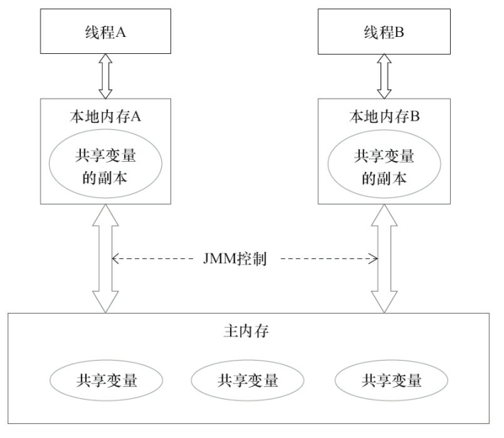
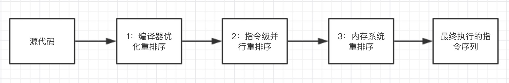

# Java内存模型

# **线程的通信和同步**
在并发编程中需要处理的两个关键问题是线程之间如何通信以及线程之间如何同步.

通信是指线程之间以何种机制来交换信息.在命令式编程中,线程之间的通信有两种:共享内存和消息传递.在共享内存的并发模型里,线程之间共享程序的公共状态,通过写-读内存中的公共状态进行隐式通信.在消息传递的并发模型里,线程之间没有公共状态,必须通过发送消息进行显示通信.

同步是指程序中用于不同线程间操作发生的相对顺序的机制.在共享内存并发模型里,同步是显示进行的.我们必须显示的指定某个方法或某段代码需要在线程之间互斥执行.在消息传递的并发模型里,由于消息的发送必须在消息的接收之前.因此同步是隐式进行的.

Java的并发采用的是共享内存模型,Java之间的通信总是隐式进行的,整个通信过成对我们是完全透明的.

# **Java内存模型的抽象结构**

在Java中所有的实例域,静态域和数组元素都存在堆内存中,堆内存在线程之间共享.局部变量,方法定义参数和异常处理器参数不会在线程之间共享,他们不会有内存可见性问题,也不会受内存模型的影响.

Java线程之间的通信由Java内存模型(Java Memory Model，JMM)控制,JMM决了一个线程对共享变量的写入何时对另一个线程可见.从抽象的角度来看,JMM定义了线程和主内存之间的抽象关系:线程之间的共享变量存储在住内存中(Main Memory),每个线程都有一个私有的本地内存(Local Memory),本地内存中存储了该线程以读/写共享变量的副本.



从图中可以看出如果线程A和线程B之间要通信的话,必须经历两个步骤.

1. 线程A把本地内存A中更新过的共享变量刷新到主内存中去.
2. 线程B到主内存中去读取线程A之前已更新过的共享变量.

在种内存模型,便产生了多线程编程中的数据“脏读”等问题。在这里举一个例子,在Java中执行下面这个语句.

```java
i = 10;
i++;
```
执行线程必须先在自己的工作线程中对变量i所在的缓存行进行赋值操作,然后再写入主存当中。而不是直接将数值10写入主存当中。假如现在有两个线程同时执行这段代码.假如初始时i的值为10,那么我们希望两个线程执行完之后i的值变为12.现在可能存在下面一种情况:初始时,两个线程分别读取i的值存入各自所在的本地内存当中,然后线程A进行加1操作,然后把i的最新值11写入到内存。此时线程B的本地内存当中i的值还是10,进行加1操作之后,i的值为11,然后线程B把i的值写入内存。最终结果i的值是11,而不是12.

# **并发编程的三大概念**

并发编程的三大概念:原子性,可见性,有序性。

## **原子性**

在Java中,对基本数据类型的变量的读取和赋值操作是原子性操作,即这些操作是不可被中断的,要么执行,要么不执行。

看如下语句四个语句

```java
x = 10;    //语句1
y = x;     //语句2
x++;       //语句3
x = x + 1; //语句4
```

在上面的四个语句中只有语句1是原子操作.其它三个语句都不是原子操作.

语句1是直接将数值10赋值给x,也就是线程执行这个语句的会直接将数值10写入到本地内存中。

语句2实际上包含2个操作,它先要去读取x的值,再将x的值写入线程的本地内存中,虽然读取x的值以及将x的值写入本地内存,这2个操作都是原子性操作,但是合起来就不是原子性操作了。

语句3中x++和 x = x+1包括3个操作:读取x的值,进行加1操作,写入新的值。

Java内存模型只保证了基本读取和赋值是原子性操作,如果要实现更大范围操作的原子性,可以通过synchronized和Lock来实现。

## **可见性**

可见性是指当多个线程访问同一个变量时,一个线程修改了这个变量的值,其他线程能够立即看得到修改的值。

对于可见性,Java提供了volatile关键字来保证可见性。当一个共享变量被volatile修饰时,它会保证修改的值会立即被更新到主存,当有其他线程需要读取时,它会去内存中读取新值。另外,通过synchronized和Lock也能够保证可见性,synchronized和Lock能保证同一时刻只有一个线程获取锁然后执行同步代码,并且在释放锁之前会将对变量的修改刷新到主存当中。因此可以保证可见性。

## **有序性**

有序性就是程序执行的顺序按照代码的先后顺序执行。

通过一下代码块说明有序性.

```java
int i = 0;
boolean flag = false;
i = 1; //语句1
flag = true; //语句2
```
从代码顺序上看,语句1是在语句2的前面,但是在JVM真正执行的时候语句2可能执行在语句1的前面.因为在这里这能发生指令重排序.下面会重点说一下重排序.

# **重排序**

重排序是指编译器和处理器为了优化程序性能而对指令序列进行重排序的一种手段.在执行程序时,为了提高性能,编译器和处理器会对指令做重排序.重排序分为3种类型.
1. 编译器优化重排序:编译器在不改变单线程程序语义情况下,可以重新安排语句的执行顺序.
2. 指令级重排序:现在处理器采用了指令级并行技术来将多条指令重叠执行.如果不存在数据依赖性,处理器可以改变语句对应机器指令的执行顺序.
3. 内存系统重排序:由于处理器使用缓存和读/写缓冲区,这使得加载和存储操作看上去可能是在乱序执行.



在上面的图中1属于编译器重排序,2和3属于处理器重排序.这些重排序可能会导致多线程程序出现内存可见性问题.对于编译器,JMM的编译器重排序规则会禁止特定类型的编译器重排序(不是所有编译器冲排序都要禁止).对于处理器重排序,JMM的处理器重排序规则会要求Java编译器在生成指令序列时,**插入特定类型的内存屏障**,通过内存屏障指令来禁止特定类型的处理器重排序.

JMM属于语言级的内存模型,他确保在不同的编译器和不同的处理器平台之上,通过禁止特定类型的编译器重排序和处理器重排序,为我们提供一致的内存可见性保证.


**数据依赖**
如果两个操作访问同一个变量,并且这两个操作中有一个为写操作,此时两个操作之间就存在数据依赖性.数据依赖性可以分为下面三种类型.

|名称|代码示例|说明|
|--|--|--|
|写后读|a=1;b=a;|写一个变量之后,再读这个位置|
|写后写|a=1;a=2;|写一个变量之后,在写这个变量|
|读后写|a=b;b=1|写一个变量之后,在写这个变量|

在上面三个操作中


**as-if-serial语义**

**内存屏障**
JMM把内存屏障指令分为4类.

**重排序对多线程影响**

# **happens-before**

# **顺序一致性**

# **volatile内存语义**

# **final语义**
